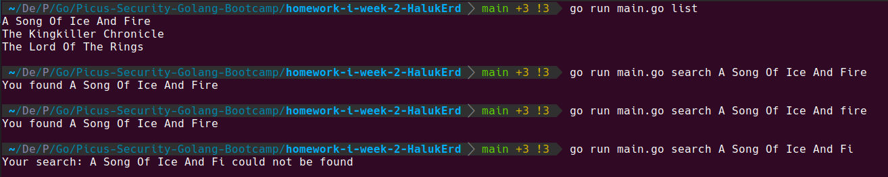

## Homework | Week 2

Elimizde bir kitap listesi var. Bu uygulamanın 2 görevi var.
1. Uygulama içerisindeki tüm kitapları çıktı olarak göstermek.
2. Girdi olarak verilen kitap ismini varsa ekrana bastırmak yok ise kitabın mevcut olmadığına dair çıktı yazdırmak.

### list command
```
go run main.go list
```
Bu komut ile uygulama içerisindeki tüm kitapları çıktı olarak görmek istiyoruz.

### search command 
```
go run main.go search <bookName>
go run main.go search Lord of the Ring: The Return of 
```
## The Result as Expected


## Explanation
I have created cmd struct to keep key of command and func to run.
```go
type cmd struct {
	key  string
	task func(params params)
}

var commands = make(map[string]cmd)
```

cmdReq represents request. Params represents traditional paramaters by using map[string]string
```go
type cmdReq struct {
	cmdKey string
	params params
}

type params map[string]string
```

handleReadArgs calls getCmdAndArgs and handles exceptional situations.
```go
func handleReadArgs() cmdReq {
	...
}

func getCmdAndArgs() (cmdReq, error) {
	...
}
```

We declare commands. Then we can find functions to run by using cmdReq's key.
We can run same function with cmdReq's params.
```go
commands["list"] = cmd{"list", printAllBooks}
commands["search"] = cmd{"search", printResultOfSearchBook}

cmdReq := handleReadArgs()
cmd := commands[cmdReq.cmdKey]
cmd.task(cmdReq.params)
```

### Notes
* I have tried to put in different files but writing go argshandler.go book.go ... main.go is nasty instead of using go run main.go
* I have used command because I consider theese are terminal commands. We could use Query cause theese are queries.